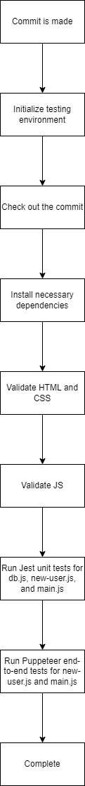

# Pipeline Status
## Already Functional
- HTML checking and validation
- CSS checking and validation
- JS checking and validation
- Jest unit testing for db.js
  - Check that new text posts can be succesfully created
- Jest unit testing for new-user.js
  - Check that db stores user information correctly when form is submitted
    - Check that db is empty when no user has been submitted
    - Check that user is stored in db when valid information is submitted
    - Check that invalid user information is not stured in db
  - Check form information validity
    - Cannot enter profile with no name
    - Cannot enter profile with no picture
    - Cannot enter null profile
    - Cannot enter undefined profile
  - Jest unit testing for main.js
    - Check that posts correctly populate by creating dummy posts and checking that the correct number exist
    - Check that a single post can be added to the database through the UI
    - Check that a single post is added in the correct order (later post is appended at the end of the list of posts)
    - Check that multiple posts are appended to the end of the post list
    - Check that posts can be successfully deleted through the UI
      - Invalid post ids should not delete anything
      - Vaid post ids should successfully delete

## In Progress and Planned
- JUnit testing for db.js
  - Check deletePost functionality
  - Check updatePost functionality
  - Check getPost functionality
  - Check deleteUser functionalit
  - Check updateUser functionality
  - Check getUser functionality
  - Check addUser functionality
- End-to-end testing for main.js
  - Check that UI is functional for adding posts
  - Check that UI is functional for deleting posts
  - Check that UI is funcitonal for editing/updating posts
  - Check that post reorderability is functional
    - When posts are reordered, information should be saved to database and be consistent across reloads
    - Page should visually change when reorder occurs

