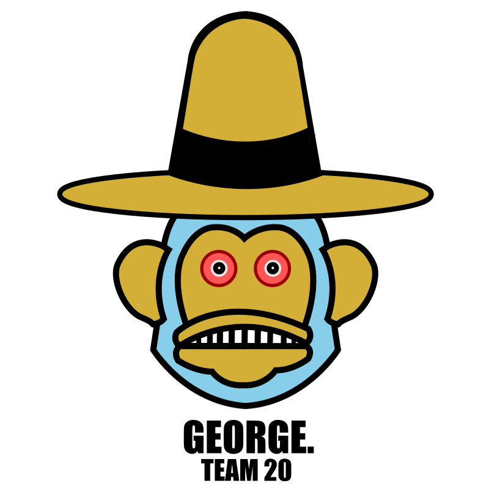

# We are George.

We're all about curiousity, innovation, respect, loyalty, innovation, teamwork, and responsibility. 
## Our Team
- Ari Brin
  - https://aribrin.github.io
  - A Junior CS major and medium decent wolrdle player.
- Benjamin Kim
  - https://7bean.github.io/CSE110-lab0/
  - fourth year Cognitive Science major and tries to be good at video games.
- Jiaying Yang
  - https://github.com/Jiy014
  - A Junior in CS & Applied Math with special interest in NLP.
- Joseph Mikhail
  - https://github.com/jsmikhai/lab1/blob/master/index.md
  - I love music and I appreciate a good laugh.
- Koa Calloway
  - https://ricefrog.github.io/CSE110-UserPage/
  - A childlike innovator who flirts heavily with ideas that enable mankind to take the next leap in human evolution.
- Mariel Chua
  - https://marielchua.github.io/Lab0-1/
  - A third year CS major interested in game development and loves Kirby
- Navid Boloorian
  - https://nboloori.github.io/cse-110-lab-1/
  - Just a guy trying to be funny. Also do CS stuff I guess.
- Roland Wen
  - https://roland-wen.github.io/CSE110-Lab0/
  - A third year CE student who is interested in computer vision
- Ryan Vanny
  - https://obarquinho.github.io/cse110/
  - I enjoy software engineering. Software engineering is my passion. I do not regret pursuing this.
- Zixian Wang
  - https://github.com/coffee-drinker
  - Second year CS major. Very new to computer and all sort of git, terminal. Excited to learn about all of them. 
