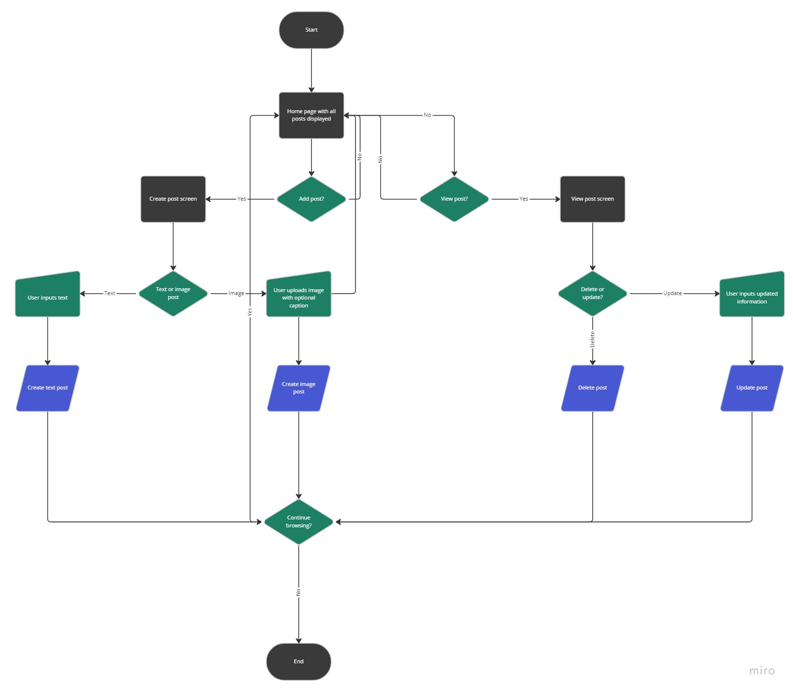
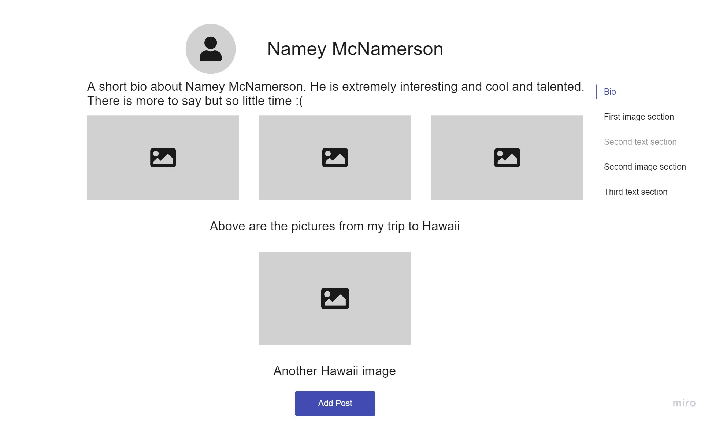
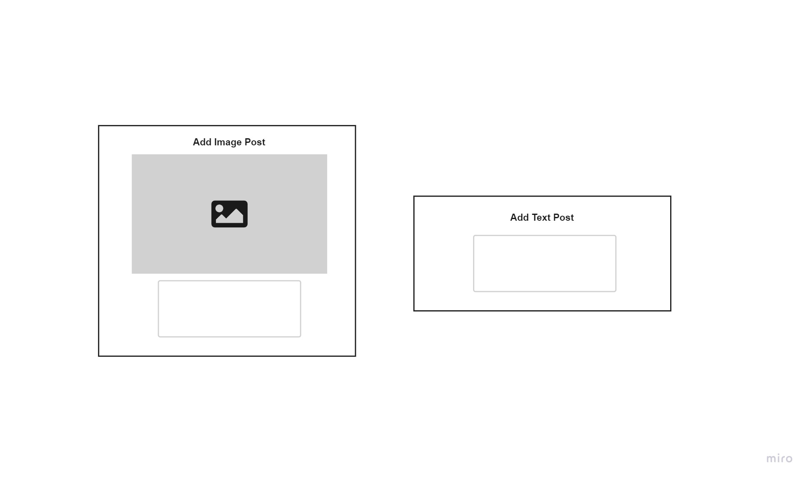

# Unplugged
## Pitch Document
### Purpose
Layout the goals of _Unplugged_ and establish an understanding of potential trials and tribulations that may be encountered so that they can be better addressed should the time come.

### The Problem
Social media has taken over people's lives in an incredibly harmful way. People want the good features it provides like self-expression and creativity but can't detatch those things from the toxic aspects. Users are forced to put up with the bad elements like a lack of privacy and social pressures if they want to experience the good ones. There is no way to separate these things.

### The Solution
_Unplugged_ is a local-first application whose goal it is to isolate the positive aspects of social media services like _Instagram_ while removing the associated toxicity. 

We want to provide a space where users are free to express themselves in the form of text and image posts without the pressures of the online world. Instead of seeking validation from strangers, users will be free to post whatever they want and strictly regulate those who see it. We want our users' information to be private to themselves and only those they volunteer it to.

#### Problems We Solve
- A lack of privacy online
  - Local-first will mean that users' data is accessible only to themselves; there is no database of information stored anywhere else
- Social media burnout
  - A lack of like/friends features will break the endless cycle of validation many social media users find themselves feeling
- Few customizability options for native gallery applications
  - We will provide the "aesthetic" appeal of Instagram user pages that aren't present on most gallery apps
- No real human connection
  - Incentivize actual human connection by making the only method of sharing be in person. If a user wants to show their friend a page, they have to physically do so 

#### Core features
- Make posts
  - Both text and image with captions
- Delete posts
- Update posts
- Determine the layout of posts on the page

#### Stretch features
- An online push functionality to publish the static contents of the user's page to a link that they can there share with those whoever they want
- Image grouping and tagging similar to a photo album
- Tabs to improve page navigation

#### User Stories
- As a private person, I want to keep all my information local, so that my privacy is protected
- As a senior citizen, I want a stripped down social media exerperience, so I can make posts without having to learn the complexities of online social media
- As a photographer, I want to be able to order my images however I want, so I can present them in an artistic way
- As a mother of a young girl, I want a local social media, so my daughter can explore without the dangers that come with the internet

#### System Diagram

- Page will consist of 1 main page and 2 popups 
- Upon selecting whether or not to make a new post, users will be prompted to select between a text and image post
- Posts will be added to the main page and users will be redirected there once submitted

#### Wireframes

- User's main page 
- Order of posts top to bottom is determined by the user

- Add post flow
- Users can add images with captions or just text

### Concerns
#### Rabbit Holes
- How to reorder elements on the page?
  - Track elements in an array and insert it at index i upon drag
- How to allow users to position their images within image blocks?
  - Each image block consists of an array, move images with similar functionality to reordering elements on page

#### Risks
- Over complication of page layout feature
- Feature creep with video and audio

#### What We're Not Doing
- Creating an online system
- User login/creation
- No custom segments beyond text and images